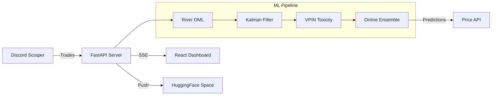

# GPO Market Engine - Public Repository

> **A High-Frequency Trading Bot for Grand Piece Online Marketplace**  
> Real-time price discovery using Online Machine Learning and Discord integration

Live Demo

🔗 **[Try it now on HuggingFace](https://areebalt26-gpo-market-live.hf.space)**

##  Features

- **Real-Time Trade Feed** - Live Discord scraping with sub-100ms latency
- **Online Machine Learning** - Price prediction using River OML & Kalman Filters
- **VPIN Toxicity Analysis** - Detect market manipulation patterns
- **HFT Architecture** - Event-driven with volume clock updates
- **Crash Recovery** - Position persistence and event sourcing

Architecture

Tech Stack

| Component | Technology |
|-----------|------------|
| Backend | FastAPI, Socket.IO, Python 3.12 |
| ML | River (Online Learning), NumPy, Custom Kalman |
| Real-Time | Server-Sent Events, WebSocket |
| Deployment | Railway, HuggingFace Spaces |
| Data | Discord API, Custom Scraping |

 Performance

-  **Sub-10ms** trade-to-UI latency
-  **Zero polling** - pure event-driven
-  **O(1) memory** ML updates
-  **55 Railway deployments**

 Key Achievements

1. **Built custom Online ML pipeline** with ADWIN drift detection
2. **Implemented HFT-style architecture** with manual GC for latency control
3. **Created real-time Discord integration** for trade monitoring
4. **Designed volume-clock sampling** for Gaussian price distributions

Note

This repository contains a showcase of the project architecture and capabilities.
The core ML algorithms and trading logic are proprietary and hosted privately.

**For the live experience, visit the [HuggingFace Space](https://areebalt26-gpo-market-live.hf.space).**

---

Created by
Aymaan Areeb Chowdhury - 2024-2026  

